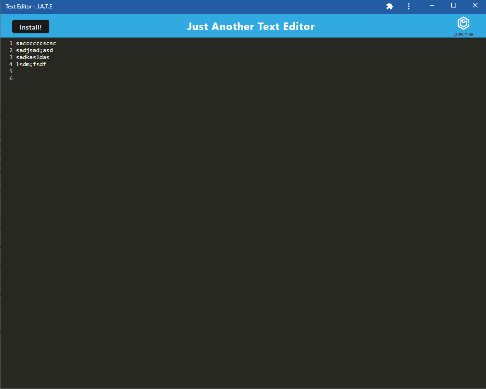

# Text Editor PWA

## Description

This is a simple and small text editor PWA. It is a simple text editor that allows you to create, edit, and save text files. It is a PWA, so it can be installed on your device and used offline. This project is made with the use of Service Workers and IndexedDB. Through creating this project, I learned about the integration and customization of caching and enabling offline usability of web applications. The usage of service workers increases the app's performance and allows for offline usage. The usage of IndexedDB allows for the storage of data in the browser, which can be used offline. This project is a great example of how to create a PWA.

## Table of Contents 

- [Installation](#installation)
- [Usage](#usage)
- [Credits](#credits)
- [License](#license)
- [Contact](#contact)

## Installation

-> First, clone the repository from: git@github.com:TamasPinter/Text_EditorPWA.git

-> Next install the dependencies by running `npm i` in the root terminal.

-> Finally run `npm start` to start both the client and server.

## Usage

-> Once the server is running, open the browser and go to localhost:3000.

-> You can now use the text editor in the browser.

-> You can also install the PWA by clicking the install button in the browser.

-> Once installed, you can use the text editor offline.

The project is deployed on Heroku and can be accessed here: https://mysterious-stream-67239.herokuapp.com/

## License

MIT License

Copyright (c) 2023 TamasPinter

Permission is hereby granted, free of charge, to any person obtaining a copy
of this software and associated documentation files (the "Software"), to deal
in the Software without restriction, including without limitation the rights
to use, copy, modify, merge, publish, distribute, sublicense, and/or sell
copies of the Software, and to permit persons to whom the Software is
furnished to do so, subject to the following conditions:

The above copyright notice and this permission notice shall be included in all
copies or substantial portions of the Software.

THE SOFTWARE IS PROVIDED "AS IS", WITHOUT WARRANTY OF ANY KIND, EXPRESS OR
IMPLIED, INCLUDING BUT NOT LIMITED TO THE WARRANTIES OF MERCHANTABILITY,
FITNESS FOR A PARTICULAR PURPOSE AND NONINFRINGEMENT. IN NO EVENT SHALL THE
AUTHORS OR COPYRIGHT HOLDERS BE LIABLE FOR ANY CLAIM, DAMAGES OR OTHER
LIABILITY, WHETHER IN AN ACTION OF CONTRACT, TORT OR OTHERWISE, ARISING FROM,
OUT OF OR IN CONNECTION WITH THE SOFTWARE OR THE USE OR OTHER DEALINGS IN THE
SOFTWARE.

## Contact

If you have any questions please email me @ tamaspinter13@gmail.com and visit my github repo for more projects:
https://github.com/TamasPinter